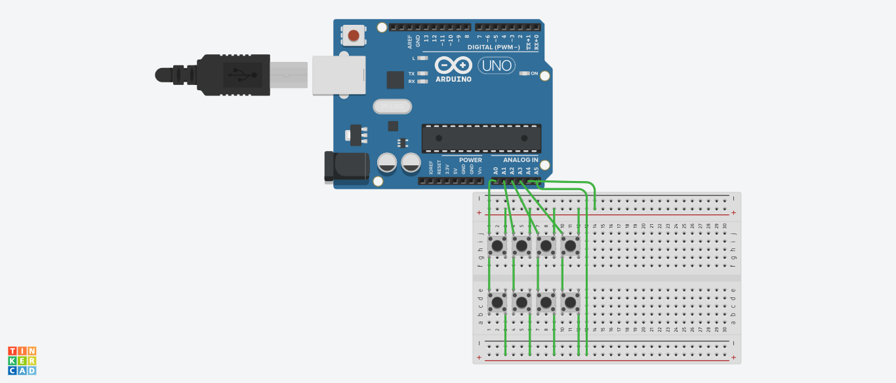

# Progetto complementi sistemi operativi 2024/2025
## Macro pad
### Obiettivo
Lo scopo del progetto è quello di realizzare un macro pad, cioè una tastiera delle macro tramite arduino, un modulo del kernel e un demone in user-space
### Funzionamento
Arduino invia un byte segnalando quale tasto della tastiera è stato premuto all seriale, il demone in user-space legge il byte, converte il numero nella macro corrispondente e
lo scrive su un character device creato dal kernel module che simula la pressione dei tasti, c'è un programma chiamato macro che è in grado di mostrare le varie macro disponibili, 
editarle e mostrare le regole secondo cui vanno scritte
### Installazione
> la seguente procedura si applica ad ubuntu 25
#### Passo base
```bash
git clone https://github.com/tizianocoluzzi/progetto_SO.git
```
#### Arduino
```bash
cd arduino
make tastiera
make tastiera.hex
cd ..
```
#### Pc
```bash
cd pc
make
``` 
- parte kernel-space
il file chardev.sh inserisce il modulo del kernel, assegna i permessi al device appena creato
```bash
cd kernel
sudo ./chardev.sh
cd ..
```
- parte user-space
esecuzione del demone in userspace
```bash
cd userspace 
./demone <inserire percorso dell'arduino>
```
eseguendo poi `./macro` si possono editare le macro disponibili
### Tastiera fisica
La tastiera fisica è facilmente ralizabile come in figura, io ho utilizzato un'arduino Mega che non era disponibile nel software per l'editing

### Altri file
- config.txt contiene l'elenco delle macro
- docs.txt contiene la documentazione, in particolare le regole per formare le macro
- common.h e common.c contengono dati in comune tra il demone e l'editor macro 
